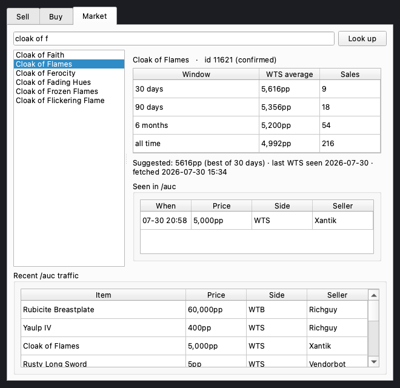

# Merchant Mode

An [nParse+](https://github.com/prokopto-dev/nparse-plus) plugin that turns your
inventory into linkable WTS auction macros, and tracks prices on both sides of
the trade.

Selling on P99 means hand-typing item links into `/auction`. Each link costs 47
raw bytes before its label, the social line buffer is a hard 255, and a link cut
mid-body sprays hex into the channel. Merchant Mode reads the item IDs out of
your own `/outputfile inventory` dump — the game's own answer, no wiki lookup —
forges the links, packs them so none is ever split, and hands you a macro pack
the Macro Editor imports.

**The plugin never sends anything.** It builds macros; you press the button.
No keystroke simulation — P99 bans it.

---

## What it looks like

Every image below is a real offscreen render of the actual window, generated by
`tools/capture_screenshots.py` — not a mockup. See [Screenshots](#screenshots).

### Sell — one merchant, every character's inventory


Dumps **accumulate**. Load one per character and they pool into a single
sellable list, because a merchant advertises for the whole account — not just
whoever happens to be logged in. Re-loading a character replaces only that
character's entry.

The list is scoped **server first, then character**, with *All characters* for
everything on that server. There is deliberately no *all servers* option: items
on different servers can't be sold to the same buyer, so a combined list is one
you'd have to mentally re-filter on every read. The server also decides which
prices apply — PigParse keys on it — so a dump loaded with EQ closed asks which
server it came from rather than guessing.

**Where** answers the question that actually matters the moment a buyer says
yes: which alt is holding this, and in which bag slot. A dump is a photograph,
though — the plugin can't know you moved something afterwards — so anything
older than a week is marked with its age (`Mulebank · General1-Slot1 (4w old)`),
and the status line names which characters are going stale. Capture time comes
from the dump file's own mtime, not from when you loaded it.

**ID** carries each item's provenance. `CONFLICT !` means your dump and PigParse
disagree, which matters because a wrong ID fails *silently*: the link renders
the right name and only goes to the wrong item when somebody clicks it. Hovering
shows both candidates and which one the link will use.

The status line counts **raw bytes**, not characters — that is what the client
charges.

### Buy — items you don't own, with IDs and prices attributed


These are items you don't own, so their IDs can only come from PigParse and stay
`unverified` until a second source agrees. An ID here is a guess until you forge
the link and click it.

Each row also carries what it would cost to buy one — and **where that number
came from**. An unattributed price is one you'd have to take on faith.

### Market — look up any item, not just the ones you own



Search any item by name and see PigParse's whole WTS block: the 30-day, 90-day,
6-month and all-time averages **each beside its sample count**. That pairing is
the point — "5k" from one sale in February and "5k" from forty last week are
very different facts, and an average without its sample size isn't an answer.
The suggested price picks the narrowest window with enough sales behind it,
because a six-month figure is still carrying whatever the item cost before the
last patch.

PigParse has no search endpoint — it only answers about exact names — so the
search box matches locally first, against a bundled list of every P99 item name
unioned with everything you've dumped or overheard. Anything you type is looked
up as-is, so an item the list has never heard of still reaches PigParse.

Below that, the raw `/auction` feed as it scrolls past — both halves of a line,
so `WTS foo 5k WTB bar 2k` lands as two rows on opposite sides. Clicking a row
opens that item in the detail panel.

### Settings


---

## What comes out

Real output from the five ticked items above (`§` stands in for the `\x12`
delimiter, which is invisible in chat):

```
250b | /auc WTS §…CoF§ 5k §…Fungi§ 12k §…JBoots§ 3k §…Fine Steel Long Sword§ 50pp
  9b | /pause 30
 82b | /auc WTS §…Bag of the Tinkerers§ 800pp
```

Four items on the first line, one on the second, and the whole thing lands at
250 of the 255 bytes available. Nothing is split.

The exported file is an `nparseplus-socials` pack, which the host's Macro Editor
imports:

```json
{
  "format": "nparseplus-socials",
  "version": 1,
  "exported_at": "2026-07-30T20:14:03",
  "label": "Xantik (P1999Green)",
  "socials": [
    {
      "page": 1,
      "button": 1,
      "name": "WTS 1",
      "color": 13,
      "lines": [
        "/auc WTS 002D65…CoF 5k 000AAF…Fungi 12k",
        "/pause 30",
        "/auc WTS 0043FB…Bag of the Tinkerers 800pp"
      ]
    }
  ]
}
```

Exporting a pack rather than writing your character ini is deliberate: the Macro
Editor already backs the ini up before its first write, merges key-by-key so
unrelated sections survive, and warns you when EQ is running (the client
rewrites these files on camp and would discard the edits).

---

## Pricing

**Fill prices** pushes what's already known onto any ticked item whose price you
left blank — and then **goes and fetches** whatever it couldn't answer, rather
than reporting that it found nothing. Two sources feed it, and live data wins:

1. **What the channel has been paying** — the median of matching auctions seen
   in `/auction`. Median, not mean, so one optimist asking 10× the going rate
   can't drag your price somewhere silly.
2. **PigParse's averages** — steadier, but slower to notice a market that's
   moved. Used when nothing has been seen live.

If only the other side of the trade has been seen, that's used and labelled as
such — a standing WTB offer is a real signal about what a thing is worth.

Matching the channel to your bags is deliberately forgiving, because nobody
types item names the way the game writes them. `WTS Fungi 27k` prices your
Fungus Covered Scale Tunic; so do `FCST` and a fumbled `Fungs Covered`. Your own
nickname table is read backwards for this, and an abbreviation two of your items
could both claim is refused rather than guessed — a wrong match here doesn't
look wrong on screen, it just prices the wrong item.

Fetching needs a **server** and nothing else. It does not need EQ to be running,
which matters because loading a dump is something you do with the game closed;
if no server is known yet, the status line says so instead of silently doing
nothing.

Prices you typed yourself are **never overwritten** by a fill; a price you chose
is a decision, and a lookup shouldn't quietly overrule it. Suggestions land in
an editable field, and every one shows its source.

---

## Throttling

A social fires every line at once, so five `/auc` lines back-to-back is exactly
the channel spam to avoid — and EQ's own throttle starts dropping them. Lines
are separated by `/pause`, three seconds by default.

This costs capacity, and it's worth knowing up front: a social holds **five
lines total**, and pauses consume them. With a pause set you get **three content
lines instead of five**. Items that don't fit spill onto the next social button
rather than being dropped. Set the pause to `0` in settings to get all five back.

---

## Using it

1. In game: `/outputfile inventory` — this writes `<Character>-Inventory.txt`
   into your EQ folder. Do it on **each** character you sell from; the dumps
   pool rather than replace one another.
2. **Sell** tab → pick your server → *Load inventory dump…* (once per character)
   → tick what you're selling.
3. *Fill prices* for the blanks, and type over anything you disagree with.
4. *Export macro pack…* and choose where to save it.
5. Open the host's Macro Editor, import the pack, and save to your character.

Re-dump a character whenever you've moved things around — the **Where** column
is only as fresh as the last dump, and it will tell you when it's getting old.

Item names can be abbreviated in the link label — `CoF` opens Cloak of Flames
just as well as the full name does, and buys you roughly a fourth item per line.
The nickname table ships with the abbreviations P99 already uses and is yours to
edit.

## Settings

| Setting | Default | Notes |
| --- | --- | --- |
| Pause between macro lines | `30` (3.0 s) | `0` disables; costs line slots |
| Max socials per export | `4` | Overflow spills onto further buttons |
| Price poll interval | `600 s` | PigParse cadence courtesy |
| Abbreviate item names | on | Uses the nickname table |
| Line prefix | `/auc WTS ` | Change the channel here |

---

## Developing

```bash
uv venv && uv pip install -e ".[dev]"
```

```bash
.venv/bin/python -m pytest -q && .venv/bin/nparseplus-plugin validate merchant_mode
```

Domain logic (link encoding, packing, dump parsing, pricing) is Qt-free and
unit-tested; Qt lives only in `window.py` and is imported inside the window
factories, so the package stays importable without PySide6 or the host app.
`tests/test_no_qt.py` enforces that rather than trusting it.

The tests that matter most are in `tests/test_packing.py`. They reproduce the
in-game probe that established the 255-byte limit byte-for-byte, and assert
*structurally* that no link is ever truncated — a length check alone would let a
corrupt line through.

### Screenshots

The images in this README are generated, not captured by hand — the same
approach the app repo uses in its own `tools/capture_screenshots.py`. Each
widget is built under `QT_QPA_PLATFORM=offscreen`, seeded with
synthetic-but-realistic data, and grabbed straight into `assets/screenshots/`:

```bash
.venv/bin/python tools/capture_screenshots.py
```

```bash
.venv/bin/python tools/capture_screenshots.py --only window--sell
```

This needs the host app installed (`PluginWindow` resolves from it), which the
`[dev]` extra provides. The seed deliberately produces a nearly-full byte budget
and one of every ID badge, so the README shows the states that are hardest to
describe in prose — `tests/test_capture_screenshots.py` asserts it still does,
so the pictures can't quietly stop matching the words.

## Licence

GPL-3.0-or-later, matching nParse+.
