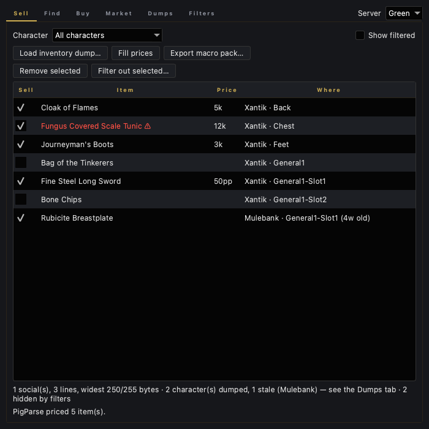
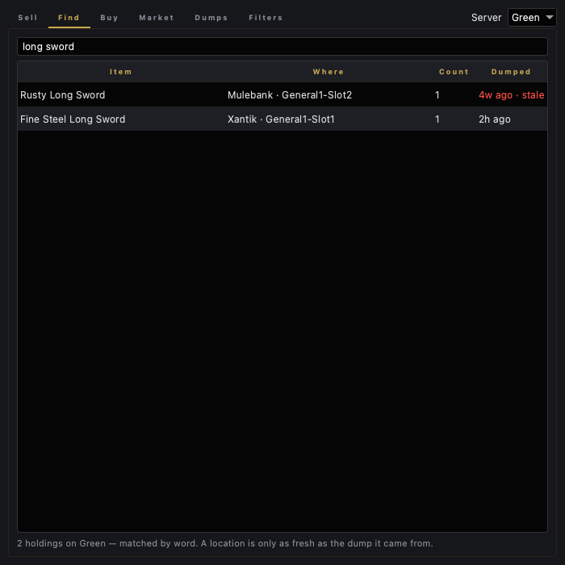
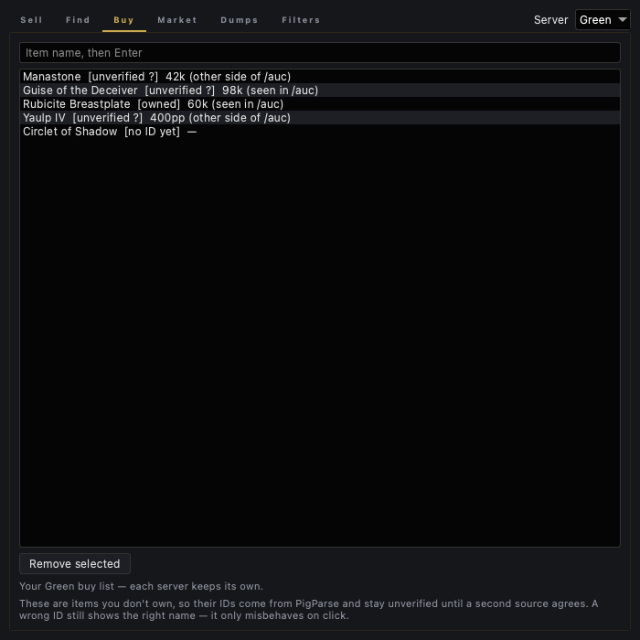
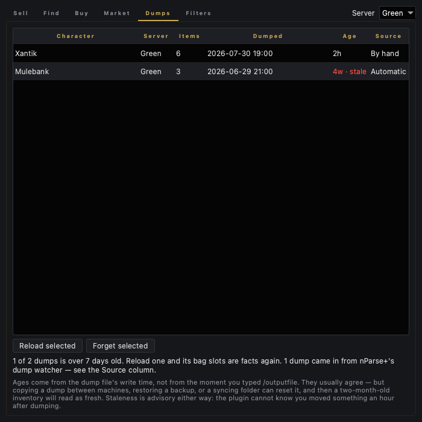
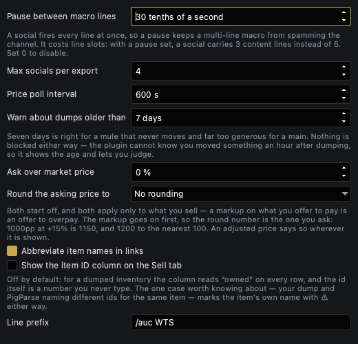

# Merchant Mode

An [nParse+](https://github.com/prokopto-dev/nparse-plus) plugin that turns your
inventory into linkable WTS auction macros, finds which mule is holding what,
and tracks prices on both sides of the trade.

Selling on P99 means hand-typing item links into `/auction`. Each link costs 47
raw bytes before its label, the social line buffer is a hard 255, and a link cut
mid-body sprays hex into the channel. Merchant Mode reads the item IDs out of
your own `/outputfile inventory` dump — the game's own answer, no wiki lookup —
forges the links, packs them so none is ever split, and hands you a macro pack
the Macro Editor imports.

**The plugin never sends anything.** It builds macros; you press the button.
No keystroke simulation — P99 bans it.

**Everything is one server at a time.** Items can't move between P99 servers, so
inventories, prices, auction sightings, your buy list and the macro pack you
export are all kept apart — see [One server, everywhere](#one-server-everywhere).

---

## What it looks like

Every image below is a real offscreen render of the actual window, generated by
`tools/capture_screenshots.py` — not a mockup. See [Screenshots](#screenshots).

### It wears whatever skin nParse+ is wearing

nParse+ 2.0 dropped its light theme and started dressing every window it owns —
Settings, the editors, the console — in the active skin. Plugin windows were not
included: the SDK hands out one class, `PluginWindow`, and it applies no styling
at all, so an add-on's window sat next to a skinned app looking like a window
from a different program.

This one doesn't. Pick **Duxa**, **Velious** or **Ledger** on the app's
Appearance page and Merchant Mode follows — the tab underline, the group
titles, the table headers, the focus ring on a field, the selection band behind
a row. It changes while you watch; there is no restart and no separate setting
here to keep in sync, because there is no setting here at all. The window asks
the app what it is wearing.

Two rules it inherits along with the colours. **The palette owns value and the
skin owns hue**: grounds, fields and body text are the same under every skin, so
picking the loudest one never costs you contrast on the thing you were reading.
And **type is a multiple of your font size**, never a pixel count — set nParse+
to 16pt and this window's headings, hints and table headers all grow with it.

### One server, everywhere

The picker beside the tabs scopes the **whole window**, and that is the plugin's
central rule rather than a convenience. Items can't move between P99 servers, so
an item on Blue can never be sold to a buyer on Green — which makes the
inventories you can list, the prices you can quote, the auctions that count as
evidence for them, your buy list and the macro pack you export all answers about
*one* server. There is no combined view of any of them, because a combined view
is one you'd have to re-filter in your head on every read, and because a Blue
price quoted on Green looks exactly like a Green price.

Three things are deliberately shared, and each is a fact about items rather than
about a market: **item IDs** (the game assigns those globally), the **item name
list** the Market search box matches against, and your **filter list** — junk is
junk on every server. The **Dumps** tab is the one view that spans servers,
because it manages the dumps themselves rather than trading with them.

### Sell — one merchant, every character's inventory



Dumps **accumulate**. One per character pools into a single sellable list,
because a merchant advertises for the whole account — not just whoever happens
to be logged in. A second dump for a character replaces only that character's
entry.

You mostly won't load them. nParse+ watches your EQ directory and files every
`/outputfile inventory` away as it appears, and Merchant Mode takes each one as
it lands: type the command on six mules and six inventories are on the Sell tab
about twenty seconds later, with no file dialog in between. *Load inventory
dump…* is still there for the dumps it never saw — a backup, another machine's
file, or a directory the host isn't watching — and the [Dumps
tab](#dumps--how-old-is-any-of-this) says which of your dumps arrived which way.
The watching is the host's Character Dumps library, which arrived in nParse+
**2.1.0**; that is the oldest app this plugin installs into.

Within the chosen server the list is scoped **by character**, with *All
characters* for everything there. A dump loaded with EQ closed asks which server
it came from rather than guessing, since that answer decides both which list it
joins and which prices apply.

**Where** answers the question that actually matters the moment a buyer says
yes: which alt is holding this, and in which bag slot. A dump is a photograph,
though — the plugin can't know you moved something afterwards — so anything past
the staleness threshold is marked with its age (`Mulebank · General1-Slot1 (4w
old)`), and the status line names which characters are going stale and points at
the [Dumps tab](#dumps--how-old-is-any-of-this). Capture time comes from the
dump file's own mtime, not from when you loaded it.

There is **no ID column** by default. For a dumped inventory it reads `owned` on
every row, and the number itself is one nobody types or reads. The single case
worth a merchant's attention is your dump and PigParse naming *different* IDs
for the same item — which matters because a wrong ID fails **silently**: the
link renders the right name and only goes to the wrong item when somebody clicks
it. That one gets a ⚠ on the item's own name, in the app's warning colour,
with both candidates and the one the link will use on hover. Turn the column
back on in [settings](#settings-1) if you want the numbers.

**Remove selected** drops rows from the stored dump — the answer to a mule
carrying two hundred bone chips you'd rather not scroll past. It crops the
plugin's copy, not the file, so reloading that character brings them back, and
the dialog says so. For anything you never want to see again, **Filter out
selected** writes a rule instead. See [Filters](#filters--the-things-you-never-sell).

Both are also on the **right-click menu**, which is where you'll actually reach
when a row of junk is under the pointer:

- *Filter out "Bone Chips"* — one row, one click, no dialog. It's reversible on
  the Filters tab and the status line reports the new count.
- *Filter out items containing…* — prefilled with the name you clicked, so
  turning `Large Bag` into "hide anything with **bag** in it" is one edit. It
  lists what the rule would catch before adding it, and refuses a pattern that
  matches nothing rather than leaving you a typo to discover later.
- *Stop filtering* — on a filtered row (with *Show filtered* on), naming the
  exact rule that caught it, and warning you if removing it brings back more
  than the row you clicked.
- *Remove n rows from this dump…* and *Manage filters…*, which opens the tab.

Right-clicking a row you hadn't selected selects it first; right-clicking
*inside* a selection leaves it alone, so "select five, right-click, filter them
all out" works.

The status line counts **raw bytes**, not characters — that is what the client
charges — and says how many rows the filter list is keeping out of the table,
because a list quietly missing rows is worse than a cluttered one.

### Find — who's holding it, right now, while they're still asking



A buyer asks *"do you have a Fungi?"* and you have a few seconds to answer.
Type part of it and this tells you which character is holding it, in which bag
slot, how many, and how old that knowledge is.

The buyer never types the name your dump uses. So the query walks a ladder:
exact first, then the same nickname-and-acronym resolution the pricing path
uses (`fungi`, `FCST`, a fumbled spelling), then plain substring for the "I only
remember part of it" case. An exact hit is never pushed below a substring hit —
ranking is most of the job here, since a list you have to scroll isn't an
answer.

Like every other tab, it answers about **one server**. The buyer asking is
standing on theirs and can only be sold to there, so a row naming a mule on
another server isn't an answer — it's a line to read past in the few seconds
this tab exists to save. There is no Server column for the same reason there is
no ID column: it would say the same thing on every row.

Filtered items *are* searched. Not advertising your Bone Chips is not the same
as not owning them, and if you went looking for them you want them found — the
Rusty Long Sword above is hidden on the Sell tab and still shows up here.

This searches your **bags**. The Market tab searches the ~25,000-name item list
— a different question, and the two are kept apart on purpose.

### Buy — items you don't own, with IDs and prices attributed



These are items you don't own, so their IDs can only come from PigParse and stay
`unverified` until a second source agrees. An ID here is a guess until you forge
the link and click it.

Each row also carries what it would cost to buy one — and **where that number
came from**. An unattributed price is one you'd have to take on faith.

The list is per server, because the prices beside it are. What you'd pay for a
Manastone on Blue is not what you'd pay on Green, and a buy price carried over
from the wrong server is a number you would act on.

### Market — look up any item, not just the ones you own


Search any item by name and see PigParse's whole WTS block: the 30-day, 90-day,
6-month and all-time averages **each beside its sample count**. That pairing is
the point — "5k" from one sale in February and "5k" from forty last week are
very different facts, and an average without its sample size isn't an answer.
The suggested price picks the narrowest window with enough sales behind it,
because a six-month figure is still carrying whatever the item cost before the
last patch.

The chart above the figures is there because the *shape* of those four numbers
is the interesting part, and a column of platinum values hides it. 30-day well
above all-time means the item is climbing. Two hundred all-time sales and two in
the last ninety days means the market for it is gone. Both are one glance in the
bars and arithmetic in the table.

- **Bar opacity is the sample count.** A 30-day average built on two sales is
  drawn faintly; an all-time average on two hundred is drawn solid. The count is
  printed above each bar as well, because opacity is a feeling and the number is
  the fact. A window PigParse knows nothing about gets a dotted stub, so
  *missing* never looks like *cheap*.
- **Live sightings are plotted against the PigParse baseline** — the dashed line
  is the same number *Fill prices* would use, so the chart and the price box can
  never disagree. WTS is a filled dot and WTB is hollow: what someone will pay
  and what someone is asking are different facts, and averaging them together is
  how a plugin talks you into the wrong price.
- **The column on the right is the spread** — low, median, high. It turns red
  when the top ask is at least double the bottom, and the line underneath says
  so in words. Two very different asks for the same item is a common P99 pattern
  rather than a curiosity, and the median alone hides it completely.

Both halves share one platinum axis on purpose. "Am I asking above or below what
the channel is doing tonight" is a comparison, and two independently-scaled
panels would make it a guess.

No new dependency was added to draw any of this — the widget is a `paintEvent`,
and everything it draws (which windows are trustworthy, where the baseline is,
whether there is anything to draw at all) is decided in `chartdata.py`, which is
Qt-free and unit-tested like the rest of the domain code.

PigParse has no search endpoint — it only answers about exact names — so the
search box matches locally first, against a bundled list of every P99 item name
unioned with everything you've dumped or overheard. Anything you type is looked
up as-is, so an item the list has never heard of still reaches PigParse.

Every number on this panel is about the server named in the heading. PigParse
keys its averages on server, and the sightings underneath were heard on one
channel — so the heading carries it rather than leaving you to remember. The
*names* are shared, because an item existing is a fact about the game; only what
it's worth is a fact about a market.

Below that, the raw `/auction` feed as it scrolls past — both halves of a line,
so `WTS foo 5k WTB bar 2k` lands as two rows on opposite sides, and only from
this server's channel. Clicking a row opens that item in the detail panel.

### Dumps — how old is any of this?



Every location this plugin shows you is a photograph of a moment that may be
weeks gone. This is the view that says so **before** you trust it, rather than
in one cell of a table after you already have.

This is the one tab that spans servers, and deliberately: it manages the dumps
themselves rather than trading with them, and a Blue dump you can't see is a
Blue dump you can't reload or forget. Every row names its server.

One row per loaded dump, with an absolute timestamp *and* a relative age,
because they answer different questions: `3d` is what you scan for, the
timestamp is what you check when the relative age looks wrong. Anything past
your threshold is flagged, and the count is repeated on the Sell tab's status
line — a warning you have to open a panel to find is a warning you meet after
the mistake.

**Source** says how each dump got here: `Automatic` for one nParse+ noticed and
handed over, `By hand` for one you picked out of a dialog or reloaded. Rows now
appear without anyone asking for them, and a row you didn't ask for is one you
have no reason to trust until it accounts for itself; the summary line repeats
the count.

**Reload selected** re-reads a dump from the file it came from. Seeing a stale
row is exactly the moment you want that, and having to re-find the file in a
dialog is the reason you wouldn't bother. Dumps loaded before v0.3.0 have no
remembered path; those say so and send you to the Sell tab. **Forget selected**
drops a character entirely, along with any listings of theirs.

The threshold is a [setting](#settings-1). Seven days is right for a mule that
never moves and far too generous for a main.

Two honest caveats, both stated in the tab itself:

- **The age is the file's write time, not the in-game dump time.** They agree
  when `/outputfile inventory` writes the file directly, which is the normal
  case. Copying a dump between machines, restoring a backup, or a syncing folder
  can reset it — and then a two-month-old inventory reads as fresh.
- **Staleness is advisory, never enforcement.** The plugin cannot know you moved
  something an hour after dumping. It shows the age; you judge.

### Filters — the things you never sell


Most of a dump is not merchandise. A main comes back from a night out holding
food, drink, bone chips, the four starting daggers every toon rolls with, and a
rack of 4-slot merchant bags — and every one of those sits in the Sell tab
between the two items you actually meant to advertise. Deleting them works until
that character dumps again; a rule outlives the dump.

A rule is three fields: what to look for, how to look for it (`contains`, `is
exactly`, `starts with`, `ends with`), and whether the hit is hidden or spared.

**Keep always wins.** *Hide anything containing "bag"* plus *keep "Bag of the
Tinkerers"* is two rules and needs no thought about which order they sit in —
which matters, because a filter list that silently depends on ordering is one
you debug rather than write. Some bags are worth selling; that is the case the
whole feature exists for.

The **Matches** column counts what each rule catches in the inventory in front
of you, because a rule that catches nothing is usually a rule with a typo in it.
The **On** checkbox switches a rule off without deleting it — *is this the rule
hiding my Fungi?* is a question you answer with a toggle, not by retyping.

Nothing is ever deleted. A filtered item stays in the dump, still turns up on
the [Find tab](#find--whos-holding-it-right-now-while-theyre-still-asking), and
comes straight back when a rule goes off — and every list that hides something
says how many. Filters are also the one preference that is **account-wide**
rather than per server: junk is junk everywhere.

The fastest way to build the list isn't this tab at all: **right-click the junk
on the Sell tab**, where you are already looking at it. This tab is where you
come to see what the rules are doing, edit them, and switch them off — not
where you'd expect to have to go to write one. **Add suggested rules** drops in
a short starter set — merchant bags, newbie armour, food and drink — as ordinary
rules you can edit or delete. Nothing is filtered until you say so.

### Settings



The page is the app's own, not a window of this plugin's — which is why it is
the one surface here that sets no styling at all. It borrows the host's names
for its parts (a note under a field is a *hint*, and says so), and the host
dresses it along with every other page in Settings.

---

## What comes out

Real output from the five ticked items above (`§` stands in for the `\x12`
delimiter, which is invisible in chat):

```
250b | /auc WTS §…CoF§ 5k §…Fungi§ 12k §…JBoots§ 3k §…Fine Steel Long Sword§ 50pp
  9b | /pause 30
 82b | /auc WTS §…Bag of the Tinkerers§ 800pp
```

Four items on the first line, one on the second, and the whole thing lands at
250 of the 255 bytes available. Nothing is split.

The exported file is an `nparseplus-socials` pack, which the host's Macro Editor
imports:

```json
{
  "format": "nparseplus-socials",
  "version": 1,
  "exported_at": "2026-07-30T20:14:03",
  "label": "Xantik (P1999Green)",
  "socials": [
    {
      "page": 1,
      "button": 1,
      "name": "WTS 1",
      "color": 13,
      "lines": [
        "/auc WTS 002D65…CoF 5k 000AAF…Fungi 12k",
        "/pause 30",
        "/auc WTS 0043FB…Bag of the Tinkerers 800pp"
      ]
    }
  ]
}
```

Exporting a pack rather than writing your character ini is deliberate: the Macro
Editor already backs the ini up before its first write, merges key-by-key so
unrelated sections survive, and warns you when EQ is running (the client
rewrites these files on camp and would discard the edits).

---

## Pricing

**Fill prices** pushes what's already known onto any ticked item whose price you
left blank — and then **goes and fetches** whatever it couldn't answer, rather
than reporting that it found nothing. Two sources feed it, and live data wins:

1. **What the channel has been paying** — the median of matching auctions seen
   in `/auction`. Median, not mean, so one optimist asking 10× the going rate
   can't drag your price somewhere silly.
2. **PigParse's averages** — steadier, but slower to notice a market that's
   moved. Used when nothing has been seen live.

If only the other side of the trade has been seen, that's used and labelled as
such — a standing WTB offer is a real signal about what a thing is worth.

Matching the channel to your bags is deliberately forgiving, because nobody
types item names the way the game writes them. `WTS Fungi 27k` prices your
Fungus Covered Scale Tunic; so do `FCST` and a fumbled `Fungs Covered`. Your own
nickname table is read backwards for this, and an abbreviation two of your items
could both claim is refused rather than guessed — a wrong match here doesn't
look wrong on screen, it just prices the wrong item.

Fetching needs a **server** and nothing else. It does not need EQ to be running,
which matters because loading a dump is something you do with the game closed;
if no server is known yet, the status line says so instead of silently doing
nothing.

Both sources are read **per server** and neither is ever borrowed from another.
An auction is stamped with the channel it was heard on when it's recorded, so an
evening on Blue and an evening on Green never average together — and a filtered
item is never asked about at all, which on a main carrying forty rows of food
and bone chips is most of the poll.

Prices you typed yourself are **never overwritten** by a fill; a price you chose
is a decision, and a lookup shouldn't quietly overrule it. Suggestions land in
an editable field, and every one shows its source.

### Asking over market, in round numbers

Two settings sit on top of all of that, and **both start off**: a percentage to
ask over market, and a scale to round the asking price to.

The markup goes on **first** and the rounding **second**, which is the whole
point of having both. A market price of 1000pp at +15% is 1150, and to the
nearest 100 that's **1200** — a number you'd actually type into `/auction`.
Rounding first would have given you 1000 back and then marked it up to 1150,
defeating both settings at once.

Two things they deliberately don't touch:

- **Your buy list.** Marking up what you offer to *pay* is an offer to overpay,
  so WTB quotes are always the market's own number.
- **The Market tab's figures.** The 30-day/90-day/6-month averages and the
  observed low–median–high are evidence, and evidence doesn't get a markup.
  Only the *Suggested* line — the one that says what to ask — is adjusted, and
  it says so: `Suggested: 1.2k (best of 6 months, then +15%, nearest 100)`.

Wherever an adjusted price appears it carries its adjustment, and the Sell tab
says `filling at market +15%, nearest 100` on its status line while the settings
are on. That is deliberate: a markup you can't see is one you read back next
week as what the market is paying, and then mark up again.

Unlike almost everything else here, these two are **account-wide**. Every price,
listing and sighting is per server because items can't cross servers — but how
you price is a fact about you, not about a market.

---

## Throttling

A social fires every line at once, so five `/auc` lines back-to-back is exactly
the channel spam to avoid — and EQ's own throttle starts dropping them. Lines
are separated by `/pause`, three seconds by default.

This costs capacity, and it's worth knowing up front: a social holds **five
lines total**, and pauses consume them. With a pause set you get **three content
lines instead of five**. Items that don't fit spill onto the next social button
rather than being dropped. Set the pause to `0` in settings to get all five back.

---

## Using it

1. In game: `/outputfile inventory` — this writes `<Character>-Inventory.txt`
   into your EQ folder. Do it on **each** character you sell from; the dumps
   pool rather than replace one another.
2. Pick your **server** at the top of the window — it scopes every tab, and it
   is what an arriving dump gets filed under.
3. **Sell** tab → tick what you're selling. The dumps are already there: nParse+
   watches the EQ folder and hands each one over within about twenty seconds.
   *Load inventory dump…* is for the files it never saw.
4. Right-click the junk → *Filter out* the first time through. You do it once;
   every dump after that arrives already tidy.
5. *Fill prices* for the blanks, and type over anything you disagree with.
6. *Export macro pack…* and choose where to save it.
7. Open the host's Macro Editor, import the pack, and save to your character.

Re-dump a character whenever you've moved things around — the **Where** column
is only as fresh as the last dump, and it will tell you when it's getting old.
The **Dumps** tab reloads one in place once you've re-run `/outputfile`.

When a buyer asks whether you have something, the **Find** tab is the fastest
way there: type part of the name and it says which character, which bag slot,
and how stale that answer is.

Selling on a second server is the same routine with the picker moved: its own
inventories, its own prices, its own buy list, its own macro pack. What follows
you across is only what isn't about a market — your filter list, and how much
you ask over it.

Item names can be abbreviated in the link label — `CoF` opens Cloak of Flames
just as well as the full name does, and buys you roughly a fourth item per line.
The nickname table ships with the abbreviations P99 already uses and is yours to
edit.

## Settings

| Setting | Default | Notes |
| --- | --- | --- |
| Pause between macro lines | `30` (3.0 s) | `0` disables; costs line slots |
| Max socials per export | `4` | Overflow spills onto further buttons |
| Price poll interval | `600 s` | PigParse cadence courtesy |
| Warn about dumps older than | `7 days` | Advisory only; never blocks |
| Ask over market price | `0 %` | Sell side only; applied before rounding |
| Round the asking price to | off | 10 / 50 / 100 / 500 / 1000 plat |
| Abbreviate item names | on | Uses the nickname table |
| Show the item ID column | off | The disagreement that matters is marked either way |
| Line prefix | `/auc WTS ` | Change the channel here |

---

## Developing

```bash
uv venv && uv pip install -e ".[dev]"
```

```bash
.venv/bin/python -m pytest -q && .venv/bin/nparseplus-plugin validate merchant_mode
```

Domain logic (link encoding, packing, dump parsing, pricing, held-item search,
item filtering, chart preparation) is Qt-free and unit-tested; Qt lives only in `window.py` and
is imported inside the window factories, so the package stays importable without
PySide6 or the host app. `tests/test_no_qt.py` enforces that rather than
trusting it, and the list of modules it checks is the list you add to.

That line is drawn tightly on purpose. `finding.py` ranks held items and knows
nothing about a table; `chartdata.py` decides what a chart should say and knows
nothing about pixels. Both are testable without a display, which is why the
Find tab's ranking and the chart's skepticism about thin samples have real tests
rather than a screenshot and some hope.

The tests that matter most are in `tests/test_packing.py`. They reproduce the
in-game probe that established the 255-byte limit byte-for-byte, and assert
*structurally* that no link is ever truncated — a length check alone would let a
corrupt line through.

### Screenshots

The images in this README are generated, not captured by hand — the same
approach the app repo uses in its own `tools/capture_screenshots.py`. Each
widget is built under `QT_QPA_PLATFORM=offscreen`, seeded with
synthetic-but-realistic data, and grabbed straight into `assets/screenshots/`:

```bash
.venv/bin/python tools/capture_screenshots.py
```

```bash
.venv/bin/python tools/capture_screenshots.py --only window--sell
```

This needs the host app installed (`PluginWindow` resolves from it), which the
`[dev]` extra provides. The tool puts the QApplication into the state the real
app leaves it in — Fusion, the app palette, the bundled Noto Sans, the active
skin — because a bare offscreen QApplication is *light*, and shots taken without
that showed a window no nParse+ user has seen since 2.0.

The seed deliberately produces a nearly-full byte budget, one of every ID badge,
a month-stale mule, one dump that arrived on its own beside one loaded by hand,
an evening of auctions that disagree with each other, and a filter rule of each
kind including one that catches nothing — so the README shows the states that
are hardest to describe in prose. `tests/test_capture_screenshots.py` asserts it
still does, so the pictures can't quietly stop matching the words.

The clock is frozen for the same reason. Ages are rendered at paint time, so a
tool that froze only the seeded timestamps would produce shots that aged on
disk: the fresh character silently going stale a week after capture, every row
growing a `(13d old)` the prose never claimed. Both ends read the same fixed
`NOW`, and a shot changes only when the plugin does.

## Licence

GPL-3.0-or-later, matching nParse+.
